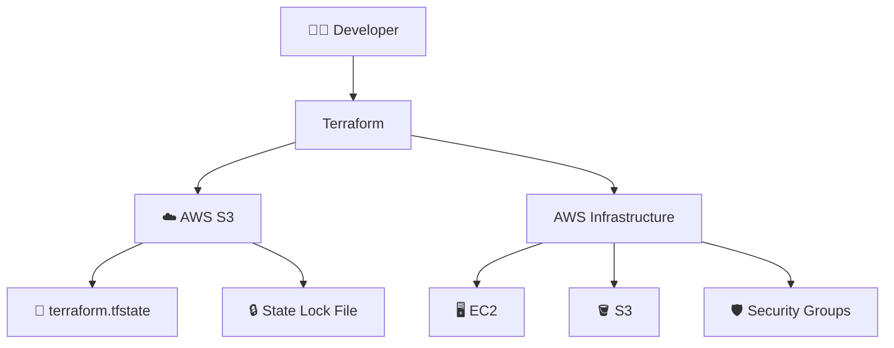

# ☁️ Terraform Remote State Infrastructure

<p align="center">


</p>

<p align="center">
  <b>🔐 Centralized Terraform State Management using AWS S3</b>
</p>

<p align="center">
  <i>Remote State • State Locking • State Versioning • Infrastructure as Code</i>
</p>

---

# 📌 Overview

This project demonstrates how to configure **Terraform remote state management using Amazon S3**.

By default, Terraform stores its state locally in:

```text
terraform.tfstate
```

For individual development this can work, but it becomes problematic when infrastructure is managed by multiple developers or CI/CD pipelines.

This project moves Terraform state to an **Amazon S3 bucket**, allowing infrastructure state to be stored centrally.

The configuration also enables **Terraform state locking using an S3 lock file**, preventing multiple Terraform operations from modifying the same state simultaneously.

---

# 🏗️ Architecture



The architecture can be summarized as:

```text
Developer
    │
    ▼
Terraform
    │
    ▼
AWS S3 Backend
    │
    ├── terraform.tfstate
    │
    └── State Lock 🔒
```

---

# 🎯 Why Remote State?

Terraform state contains the information Terraform uses to map configuration to real infrastructure.

With local state:

```text
Developer Laptop
       │
       ▼
terraform.tfstate
```

Only the developer's local environment has the current state.

With remote state:

```text
Developer A ──┐
              │
Developer B ──┼──► Terraform ──► S3
              │                  │
CI/CD ────────┘                  ├── State
                                 └── Lock
```

This provides a centralized location for Terraform state.

---

# ☁️ Amazon S3 Backend

The Terraform backend is configured in `terraform.tf`:

```hcl
terraform {
  backend "s3" {
    bucket       = "remote-infra-bucket-terraform"
    key          = "terraform.tfstate"
    region       = "us-east-1"
    use_lockfile = true
  }
}
```

### Backend configuration

| Setting        | Value                           | Purpose                        |
| -------------- | ------------------------------- | ------------------------------ |
| `bucket`       | `remote-infra-bucket-terraform` | S3 bucket storing state        |
| `key`          | `terraform.tfstate`             | State object path              |
| `region`       | `us-east-1`                     | AWS region                     |
| `use_lockfile` | `true`                          | Enables S3-based state locking |

---

# 🔒 State Locking

One of the most important features of this setup is **state locking**.

State locking prevents multiple Terraform processes from modifying the same state simultaneously.

The configuration:

```hcl
use_lockfile = true
```

enables S3-based locking.

### Without locking

```text
Developer A
     │
     ├── terraform apply
     │
     ▼
   State
     ▲
     │
     └── terraform apply
     │
Developer B
```

Both operations could attempt to modify the same state.

### With locking

```text
Developer A
     │
     ▼
terraform apply
     │
     ▼
🔒 LOCK ACQUIRED
     │
     ▼
Update infrastructure
     │
     ▼
Update state
     │
     ▼
🔓 LOCK RELEASED
```

If Developer B tries to modify the same state while it is locked:

```text
Developer B
     │
     ▼
terraform apply
     │
     ▼
🔒 State already locked
     │
     ▼
Terraform prevents conflicting operation
```

This reduces the risk of concurrent Terraform operations corrupting or conflicting over shared state.

---

# 🪣 S3 Bucket

The S3 bucket is defined in `s3.tf`:

```hcl
resource "aws_s3_bucket" "remote_infra" {

  bucket = "remote-infra-bucket-terraform"

  tags = {
    Name        = "remote-infra-bucket-terraform"
    Environment = "Dev"
  }
}
```

The bucket is responsible for storing the Terraform state.

Conceptually:

```text
AWS
 │
 └── S3
      │
      └── remote-infra-bucket-terraform
             │
             └── terraform.tfstate
```

---

# 🔐 Terraform State Security

Terraform state can contain information about your infrastructure and may contain sensitive values depending on the resources being managed.

Therefore, remote state should be treated as sensitive infrastructure data.

Recommended protections include:

```text
                    S3 State Bucket
                          │
             ┌────────────┼────────────┐
             ▼            ▼            ▼
          🔐 IAM      🔒 Encryption   🕒 Versioning
```

For a production implementation, consider enabling:

* S3 server-side encryption
* S3 versioning
* Restricted IAM access
* Bucket public-access blocking
* CloudTrail auditing
* Separate state buckets/accounts for stronger isolation

---

# 📁 Project Structure

```text
remote-infra/
│
├── 📄 provider.tf
├── 📄 s3.tf
├── 📄 terraform.tf
├── 📄 .gitignore
└── 📄 README.md
```

---

# 📄 provider.tf

The AWS provider specifies the AWS region where the infrastructure will be created.

```hcl
provider "aws" {

  region = "us-east-1"

}
```

The project therefore creates the remote state infrastructure in:

```text
AWS Region
    │
    ▼
us-east-1
    │
    ▼
S3
```

---

# 📄 s3.tf

This file creates the S3 bucket.

```hcl
resource "aws_s3_bucket" "remote_infra" {

  bucket = "remote-infra-bucket-terraform"

  tags = {

    Name        = "remote-infra-bucket-terraform"
    Environment = "Dev"

  }

}
```

---

# 📄 terraform.tf

This file defines:

1. Terraform version/provider requirements
2. The AWS provider
3. The S3 backend
4. State locking

```hcl
terraform {

  required_providers {

    aws = {
      source  = "hashicorp/aws"
      version = "5.91.0"
    }

  }

  backend "s3" {

    bucket       = "remote-infra-bucket-terraform"
    key          = "terraform.tfstate"
    region       = "us-east-1"
    use_lockfile = true

  }

}
```

---

# 🔄 Bootstrap Problem

There is an important Terraform concept involved in this project.

Terraform needs to initialize the backend **before** it can manage resources using that backend.

But the S3 bucket itself is created by Terraform.

Therefore:

```text
Terraform
   │
   ├── Needs S3 bucket
   │       │
   │       └── to initialize backend
   │
   └── But S3 bucket is created by Terraform
```

This creates a **bootstrap dependency**.

The recommended approach is to separate the process into two stages.

---

# 🚀 Bootstrap Workflow

## Stage 1 — Create the S3 bucket

Initially, create the S3 bucket using local state.

```text
Terraform
   │
   ▼
Local State
   │
   ▼
Create S3 Bucket
```

Then the S3 bucket exists.

---

## Stage 2 — Configure the S3 backend

Configure:

```hcl
backend "s3" {

  bucket       = "remote-infra-bucket-terraform"
  key          = "terraform.tfstate"
  region       = "us-east-1"
  use_lockfile = true

}
```

Then initialize:

```bash
terraform init
```

If Terraform detects an existing local state:

```bash
terraform init -migrate-state
```

Terraform will ask whether the existing state should be migrated to the S3 backend.

Confirm with:

```text
yes
```

The architecture then becomes:

```text
Before

Developer
   │
   ▼
Local terraform.tfstate


After

Developer
   │
   ▼
Terraform
   │
   ▼
AWS S3
   │
   ├── terraform.tfstate
   └── lock file
```

---

# 🛠️ Terraform Workflow

## 1️⃣ Initialize

```bash
terraform init
```

Initializes Terraform and downloads the required AWS provider.

---

## 2️⃣ Format

```bash
terraform fmt
```

Formats Terraform configuration files.

---

## 3️⃣ Validate

```bash
terraform validate
```

Checks whether the Terraform configuration is syntactically valid.

---

## 4️⃣ Plan

```bash
terraform plan
```

Shows the changes Terraform intends to make.

---

## 5️⃣ Apply

```bash
terraform apply
```

Creates or modifies the infrastructure.

---

## 6️⃣ Check State

```bash
terraform state list
```

Displays resources managed by the current Terraform state.

---

## 7️⃣ Destroy

```bash
terraform destroy
```

Removes the infrastructure managed by this Terraform configuration.

⚠️ Use carefully.

---

---

# ⭐ Summary

This project establishes an AWS-based remote Terraform state architecture using:

```text
Terraform
    +
AWS S3
    +
State Locking
    +
Infrastructure as Code
```

The result is a centralized and collaborative foundation for managing Terraform infrastructure safely across development, testing, production, and future CI/CD workflows.

<p align="center">

### ☁️ Terraform + AWS

**Provision • Store • Lock • Manage**

</p>
